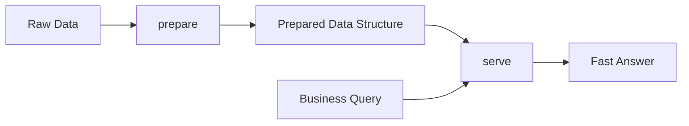
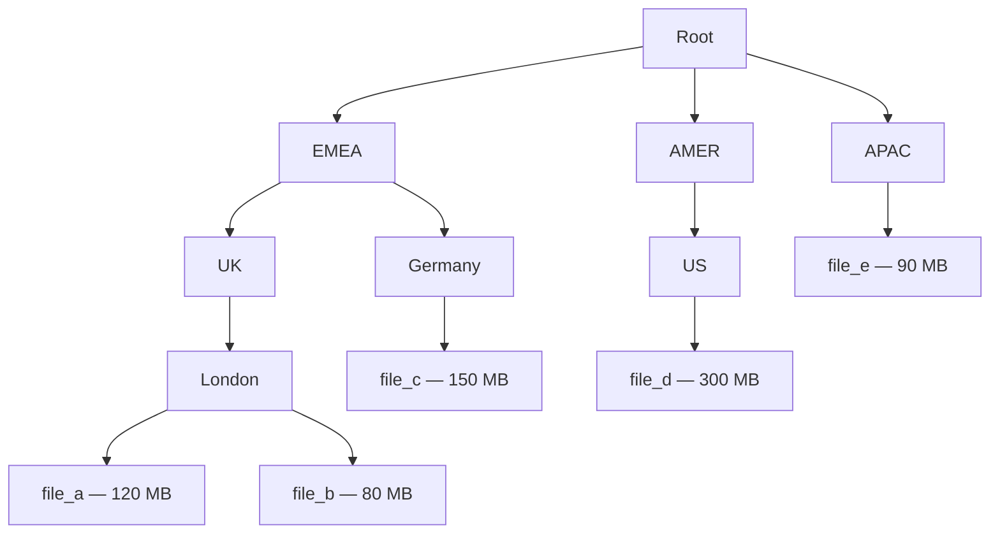
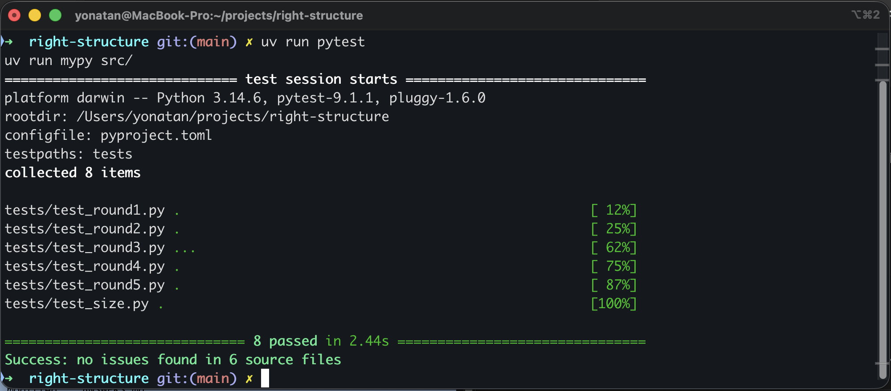
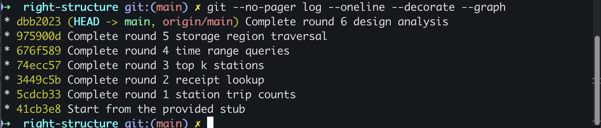

<p align="center">
  
</p>

# Right Data Structure

A Python engineering project exploring how changing business requirements drive different data-structure decisions — from constant-time lookups and Top-K selection to fast range queries and recursive tree traversal.

<p>
  
  
  
  
</p>

## Overview

**Right Data Structure** is a Python project built around one engineering principle:

> **The right data structure depends on the workload it needs to serve.**

The project starts with bike-share trip data and introduces a new business requirement in each round.

Each requirement changes how the data needs to be accessed, forcing a different structural decision — from hash-based indexing to Top-K selection, binary search, prefix sums, and recursive tree traversal.

The goal is not only to return the correct answer, but to satisfy explicit computational-cost requirements and understand the trade-offs behind each design.

## Architecture

Every round follows the same core pattern:



`prepare()` performs work ahead of time and transforms the source data into a representation designed for the expected workload.

`serve()` handles the request path and answers queries using only that prepared representation.

This creates a clear separation between data preparation and query execution while hiding the internal structure from callers.

## Engineering Progression

| Round | Business Requirement | Structure / Strategy | Key Idea |
|---|---|---|---|
| 1 | Count trips by station | `dict[Station, int]` | Constant-time lookup |
| 2 | Keep station counts and find a trip from its receipt | Two hash indexes | Multiple access patterns |
| 3 | Return the Top-K stations by total distance | Station totals + Min Heap | Keep only the strongest `k` candidates |
| 4 | Total distance inside arbitrary time ranges | Sorted timestamps + prefix sums | Fast boundaries + constant-time totals |
| 5 | Find the largest top-level storage region | Recursive tree traversal | Aggregate hierarchical data |
| 6 | Evaluate how requirements changed the design | Written architecture analysis | Workload-driven decisions |

## Round 1 — Constant-Time Station Lookup

The first requirement is to repeatedly answer how many trips started at a given station.

Scanning every trip for every request would make query cost grow with the dataset.

Instead, `prepare()` builds a hash map once:

```text
Station → Trip Count
```

For example:

```text
Station A → 1,204
Station B →   873
Station C → 2,011
```

`serve()` can then answer each station query using a direct dictionary lookup.

**Query cost:** `O(1)`

## Round 2 — Multiple Access Patterns

The next requirement arrives without replacing the first.

The dashboard still needs station counts, while support also needs to retrieve a specific trip using the station and trip ID printed on a customer's receipt.

The prepared representation therefore evolves into two indexes:

```text
Station → Trip Count

(Station, TripId) → Trip
```

The first index serves the existing dashboard workload.

The second provides direct access to individual trips.

Both access patterns remain constant-time at the cost of additional preparation work and memory.

**Query cost:** `O(1)`

This round demonstrates an important engineering trade-off:

> Additional indexes cost memory, but can eliminate expensive repeated scans from the request path.

## Round 3 — Top-K with a Min Heap

The workload changes again.

Instead of retrieving one station, the system now needs the `k` stations with the highest total ridden distance.

`prepare()` first aggregates distance by station:

```text
Station → Total Distance
```

During the query, a **Min Heap** keeps only the current Top-K candidates.

Conceptually:

```text
Current Top-K

        weakest
           ↓
          500
         /   \
       900   700
      /   \
    1200   1100
```

The smallest value in the current Top-K remains at the root.

When a new candidate arrives, the algorithm only needs to ask:

```text
Is the new candidate stronger than the weakest
member of the current Top-K?
```

If not, it is ignored.

If it is, the weakest candidate is replaced and the heap restores its ordering.

This avoids fully sorting every station just to keep the strongest `k`.

The heap operations are implemented manually in the project:

```text
_sift_up()
_sift_down()
_pop_weakest()
```

This makes the mechanics of maintaining the heap explicit rather than hiding them behind a library call.

## Round 4 — Fast Time-Range Aggregation

The next requirement asks for the total distance of trips starting inside arbitrary time ranges.

For example:

```text
09:00 ≤ started_at < 11:00
```

Scanning every trip for every request would be too expensive.

The prepared representation combines two structures:

```text
Sorted timestamps
        +
Prefix sums
```

Conceptually:

```text
Timestamp     Distance     Prefix Total
---------     --------     ------------
09:00            100            100
09:10            200            300
09:20            300            600
09:30            400           1000
```

Binary search finds the lower and upper boundaries of the requested range.

Once those positions are known, the total distance is calculated by subtracting two prefix sums instead of scanning every trip inside the range.

```text
Find range boundaries → O(log n)

Calculate range total → O(1)
```

A range containing 40,000 trips can therefore be aggregated with the same arithmetic cost as a range containing only a few trips.

### Read-heavy vs. write-heavy

This structure is especially effective when the dataset is prepared once and queried repeatedly.

If trips were inserted continuously, however, the trade-off would change.

A new timestamp may need to be inserted into the middle of the ordered representation:

```text
09:00
09:10
09:15  ← new trip
09:20
09:30
```

Elements after the insertion point may need to move, and all later prefix sums must be updated.

That can make an insertion cost `O(n)`.

For workloads containing frequent inserts as well as range queries, a dynamic structure such as a balanced search tree becomes more attractive.

## Round 5 — Recursive Tree Traversal

The final coding round changes the shape of the source data itself.

The data no longer arrives as a flat collection of trips.

Instead, storage regions form a hierarchy where regions may contain other regions, the nesting depth is not fixed, and only file nodes contain sizes.



A region does not directly store its total size.

Its size depends on every file below it:

```text
London = 120 + 80
       = 200 MB

UK     = 200 MB

EMEA   = 200 + 150
       = 350 MB
```

Because the depth of the hierarchy is unknown, the traversal is recursive.

The core idea is:

```text
File?
  ↓ yes
return its size

Region?
  ↓
calculate the total size
of every child recursively
```

After calculating each top-level subtree, the project keeps only the largest region and its total size:

```text
(region_name, total_size)
```

This round demonstrates a different kind of structural decision: instead of choosing a new container for faster queries, the hierarchy already exists in the source data and the challenge is traversing it correctly.

## Round 6 — Architecture and Trade-offs

The final round moves from implementation to design analysis.

It reviews why each business requirement forced a different prepared representation and explores how those decisions would behave in a larger system.

### Changing Workloads Change the Right Structure

Round 4's sorted timestamps and prefix sums are highly effective for a read-heavy workload.

If the workload changes to include frequent inserts, maintaining those structures becomes expensive.

The correct structure therefore depends not only on the shape of the data, but also on whether the workload is:

```text
read-heavy
write-heavy
lookup-heavy
range-heavy
Top-K
hierarchical
```

### Encapsulation

The prepared representation is hidden behind a small interface:

```text
Raw Data
   ↓
prepare()
   ↓
Prepared Structure
   ↓
serve()
   ↓
Answer
```

Callers do not need to know whether the internal representation is:

```text
dict
tuple
heap
sorted arrays
prefix sums
or another structure
```

This matters when requirements change.

If every caller accessed the prepared structure directly, changing its representation would require updating every caller that depended on the old layout.

By keeping the representation behind `prepare()` and `serve()`, structural changes remain local instead of spreading throughout the codebase.

## Complexity at a Glance

| Problem | Strategy | Cost |
|---|---|---|
| Station count | Hash lookup | `O(1)` query |
| Receipt lookup | Composite-key hash lookup | `O(1)` query |
| Top-K stations | Min Heap | Avoid full sorting |
| Time-range boundaries | Binary search | `O(log n)` query |
| Range aggregation | Prefix sums | `O(1)` after boundaries |
| Storage hierarchy | Recursive traversal | Linear traversal of the tree |

## Correctness and Cost Validation

The project validates more than whether the final answers are correct.

Instrumented domain objects count the operations performed by each solution:

| Operation | What is measured |
|---|---|
| Hashing | Hash-based access |
| Comparisons | Equality checks |
| Ordering | Ordering operations |
| Arithmetic | Distance additions and subtractions |

This makes algorithmic cost testable without relying on unstable wall-clock benchmarks.

A solution therefore needs to satisfy both:

- **correctness**
- **the required computational cost**

<p align="center">
  
</p>

Current validation:

```text
8 passed
Success: no issues found in 6 source files
```

## Type Safety

Each round explicitly names its prepared representation using a `TypeAlias`.

For example:

```python
Round1Prepared: TypeAlias = dict[Station, int]
```

The same type connects both sides of the design:

```text
prepare() → Round1Prepared → serve()
```

The type returned by `prepare()` must match the type consumed by `serve()`.

MyPy checks that contract statically, making the structural decision part of the type system instead of leaving it as an undocumented implementation detail.

## Project Evolution

Each round was committed separately so the repository history shows how the structure changed as new requirements arrived.

<p align="center">
  
</p>

The progression is intentionally visible:

```text
Provided Stub
     ↓
Round 1 — Station Counts
     ↓
Round 2 — Receipt Lookup
     ↓
Round 3 — Top-K
     ↓
Round 4 — Range Queries
     ↓
Round 5 — Tree Traversal
     ↓
Round 6 — Design Analysis
```

This makes the Git history part of the engineering story rather than only a record of the final result.

## Tech Stack

| Category | Technology |
|---|---|
| Language | Python 3.11+ |
| Testing | Pytest |
| Static type checking | MyPy |
| Dependency management | uv |
| Version control | Git / GitHub |

## Project Structure

```text
right-structure/
├── assets/
│   ├── hero.png
│   └── screenshots/
│       ├── git-history.png
│       └── validation.png
├── given/
│   ├── catalog.py
│   ├── fixtures.py
│   ├── probe.py
│   └── round.py
├── src/
│   ├── round1.py
│   ├── round2.py
│   ├── round3.py
│   ├── round4.py
│   └── round5.py
├── tests/
├── ANSWERS.md
├── pyproject.toml
└── README.md
```

## Getting Started

### Prerequisites

Install:

- Git
- Python 3.11+
- uv

### Clone the repository

```bash
git clone git@github.com:YoniAfengar/right-structure.git
cd right-structure
```

### Run the test suite

```bash
uv run pytest
```

Expected result:

```text
8 passed
```

### Run static type checking

```bash
uv run mypy src/
```

Expected result:

```text
Success: no issues found in 6 source files
```

## Key Engineering Lessons

### Design for the Query

The source data alone does not determine the best representation.

The questions the system needs to answer — and how frequently it needs to answer them — determine which structure makes sense.

### Pay Once, Serve Many

For read-heavy workloads, expensive work can often be moved into `prepare()` so the request path remains fast.

Instead of repeatedly scanning raw data:

```text
prepare once
     ↓
build the right representation
     ↓
serve many times
```

### Every Optimization Has a Cost

Faster reads are not free.

Additional indexes consume memory.

Sorted representations make some writes more expensive.

Prefix sums make range aggregation extremely cheap but become expensive to maintain when data changes.

The right decision depends on the workload.

### Requirements Change the Right Answer

A dictionary was enough for Round 1 but insufficient once Round 2 introduced a second access pattern.

A Min Heap became useful when the requirement changed to Top-K.

Sorted timestamps and prefix sums became useful when the workload changed to range aggregation.

Recursion became necessary when the data itself became hierarchical.

There is no universally best data structure.

There is only the structure that best fits the problem being served.

## Author

**Yonatan Afengar**

Data Engineer focused on Python, SQL, data platforms, backend systems, and building reliable data workflows.